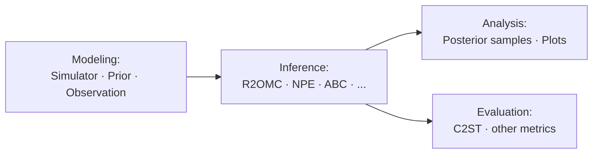

# LFI

`lfi` is a Python package for **simulation-based (likelihood-free) inference (SBI/LFI)**. It provides a unified interface for defining simulators and priors, running inference, and analysing posterior samples — making it easy to compare methods or build new ones.

The package includes classic ABC methods, neural posterior estimators (NPE, FMPE via [sbi](https://github.com/sbi-dev/sbi)), and its primary contribution: **R2OMC**, a gradient-based optimisation-then-sampling approach that scales to high-dimensional simulators and automatically identifies informative output dimensions.

> **R2OMC paper:** [arxiv.org/abs/2511.13394](https://arxiv.org/abs/2511.13394)



## Installation

Requires **Python 3.11**. The base install covers R2OMC (JAX-based); optional extras add torch/SBI and ELFI support.

| Variant | Command | Adds |
|---------|---------|------|
| Base (R2OMC / JAX) | `pip install -e .` | jax, optax, scipy, sklearn |
| ELFI | `pip install -e ".[elfi]"` | elfi |
| Torch CPU | see below | torch (cpu), torchvision, sbi |
| Torch GPU | `pip install -e ".[torch-gpu]"` | torch (gpu), torchvision, sbi |
| Full CPU | see below | all of the above |

For CPU torch variants, pre-install torch before `lfi`:

```bash
pip install torch --index-url https://download.pytorch.org/whl/cpu
pip install -e ".[torch-cpu]"   # or .[full-cpu]
```

> **GPU JAX:** the base install uses CPU JAX. For GPU acceleration run `pip install jax[cuda12]` after installing `lfi`.

## Quick Start

```python
import numpy as np
from lfi.priors import UniformPrior
from lfi.simulators import GaussianNoise
from lfi.inference.r2omc import R2OMC

prior      = UniformPrior(dim=2, low=-1, high=1)
simulator  = GaussianNoise(dim=2, dim_y=2, sigma_noise=0.1)
observation = np.array([[0.5, 0.5]])

method  = R2OMC(prior=prior, simulator=simulator, observation=observation)
samples = method.fit_and_sample(budget=1000, nof_samples=100)
method.plot_posterior_samples(th_true=np.array([0.5, 0.5]))
```

All inference methods share the same interface:

```python
method.fit(budget, fit_kwargs={})          # run inference
samples = method.sample(nof_samples, sample_kwargs={})  # draw posterior samples
# or combined:
samples = method.fit_and_sample(budget, nof_samples)
```

## Example Scripts

Ready-to-run scripts live in `examples/scripts/`. All require the base install except the MNIST example.

| Script | Problem | Prior | Simulator |
|--------|---------|-------|-----------|
| `r2omc_gaussian_noise.py` | Gaussian noise | Uniform | `GaussianNoise` |
| `r2omc_two_moons.py` | Two Moons | Uniform | `TwoMoons` |
| `r2omc_slcp.py` | SLCP — single & multi-obs | Uniform | `SLCP` |
| `r2omc_slcp_distractors.py` | SLCP + distractor dims | Uniform | `SLCPDistractors` |
| `r2omc_lotka_volterra.py` | Lotka-Volterra ODE | LogNormal | `LotkaVolterra` |
| `r2omc_mnist.py` | MNIST image denoising | Uniform | `ImagePixelWiseTransform` — needs `lfi[torch-cpu/gpu]` |

```bash
python examples/scripts/r2omc_slcp.py
python examples/scripts/r2omc_mnist.py   # needs torch extras
```

## API Reference

### Priors

| Class | Description | Key parameters |
|-------|-------------|----------------|
| `UniformPrior` | $\theta \sim \mathcal{U}(\text{low}, \text{high})^d$ | `dim`, `low`, `high` |
| `Normal` | $\theta \sim \mathcal{N}(\mu, \sigma^2 I)$ | `dim`, `mean`, `std` |
| `LogNormal` | $\log\theta \sim \mathcal{N}(\mu, \sigma^2 I)$ | `dim`, `mean`, `std` |

Custom priors: inherit `BasePrior` (`lfi/priors.py`) and implement `sample_numpy`, `sample_jax`.

### Simulators

| Class | Description |
|-------|-------------|
| `GaussianNoise` | $y = \theta + \epsilon,\quad \epsilon \sim \mathcal{N}(0, \sigma^2 I)$ |
| `BimodalGaussian` | $y \sim 0.5\,\mathcal{N}(\theta-3,\sigma I) + 0.5\,\mathcal{N}(\theta+3,\sigma I)$ |
| `TwoMoons` | Two-moons benchmark (2D) |
| `SLCP` | Simple Likelihood Complex Posterior (5D → 2D) |
| `SLCPDistractors` | SLCP extended with noise output dims |
| `LotkaVolterra` | Predator-prey ODE (4 params → 20 time-series outputs) |
| `ImageNoise` | Clean image → checkerboard-filtered + noisy image |
| `ImagePixelWiseTransform` | Clean image → pixel-compressed + noisy image |

Custom simulators: inherit `BaseSimulator` (`lfi/simulators/base.py`) and implement `sample_jax` (required for R2OMC) and optionally `sample_numpy`, `sample_pytorch`.

### Observations

Pass as `np.ndarray` of shape `(N, D_y)` — `N` independent observations, `D_y` output dimension. Single observation: shape `(1, D_y)`.

### Inference Methods

| Class | Module | Description | Extras |
|-------|--------|-------------|--------|
| `R2OMC` | `lfi.inference.r2omc` | R2OMC — single observation | base |
| `R2OMCMultiObs` | `lfi.inference.r2omc` | R2OMC — multiple observations | base |
| `ABCRejection` / `ABCRejectionJAX` | `lfi.inference.native` | Rejection ABC (numpy / JAX) | base |
| `SMCInference` / `SMCInferenceJAX` | `lfi.inference.native` | SMC-ABC (numpy / JAX) | base |
| `NPEASingleRound` | `lfi.inference.sbi` | Neural Posterior Estimation A | torch |
| `NPECSingleRound` / `NPECMultiRound` | `lfi.inference.sbi` | Neural Posterior Estimation C | torch |
| `FMPESingleRound` | `lfi.inference.sbi` | Flow Matching Posterior Estimation | torch |
| `BayesFlow` | `lfi.inference.sbi` | BayesFlow posterior estimation | torch |
| `SBI_MCABC` / `SBI_SMCABC` | `lfi.inference.sbi` | MC-ABC / SMC-ABC via SBI | torch |
| `RejectionSampling` / `SMCRejection` | `lfi.inference.elfi` | ABC via ELFI | elfi |
