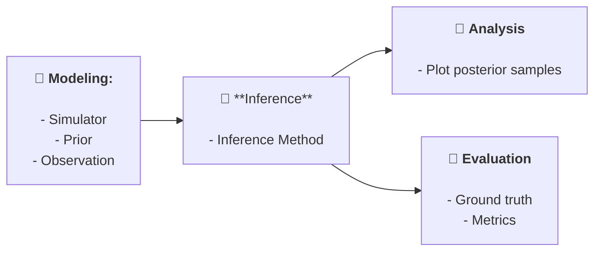

# LFI 

*A Python package for likelihood-free inference (LFI) methods.* 

## How It Works

`lfi` follows a structured pipeline consisting of four main stages:



Simple example: 
    
```python
import lfi
import torch
import numpy as np

# set seed
np.random.seed(42)
torch.manual_seed(42)

# modeling
prior = lfi.priors.UniformPrior(dim=2, low=-1, high=1)
simulator = lfi.simulators.GaussianNoise(dim=2, dim_y= 2, sigma_noise=0.1)
observation = np.array([[0.5, 0.5]])

# inference
method = lfi.inference.from_sbi.NPE_C_SingleRound(
    prior=prior,
    simulator=simulator,
    observation=observation
)
samples_inferred = method.fit_and_sample(budget=1000, nof_samples=100)

# analysis
method.plot_posterior_samples(samples_inferred)

# evaluation
samples_gt = lfi.ground_truth.Gaussian(
    dim=2,
    mu=np.array([0.5, 0.5]),
    sigma=np.array([[0.1, 0.1]])
).sample(100)
lfi.evaluation.c2st(samples_inferred, samples_gt)
# 0.54
```

### Simulator

Example usage:

``` python
simulator = lfi.simulators.GaussianNoise(sigma_noise=0.1)
```

Ready-to-use simulators are available in `lfi/simulators.py`:

| Name               | Description                                                                                  |
|--------------------|----------------------------------------------------------------------------------------------|
| `gaussian_noise`   | $y \sim \theta + \epsilon$                                                                   |
| `bimodal_gaussian` | $y \sim 0.5 \mathcal{N}(y; \theta - 3, \sigma I) + 0.5 \mathcal{N}(y; \theta + 3, \sigma I)$ |


- To implement a simulator from scratch, inherit the `BaseSimulator` class and implement the required methods
- There are four methods that you can implement: `sample_numpy`, `sample_pytorch`, `sample_jax`, and `return_elfi_callable`.
- There is no need to implement all of them. If you want to use a simulator with a specific inference method, you need to implement the corresponding method. Check the compatibility table below.

Compatibility table:

| Inference Class | Path                 | Simulator requirement  |
|-----------------|----------------------|------------------------|
| SBI             | `inference/from_sbi` | `sample_pytorch`       |
| ELFI            | `inference/from_elfi`| `return_elfi_callable` |
| custom          | `inference/custom`   | depends on the method  |


### Step 1: Define the Inference Method

To define an inference method, specify the prior, simulator, and observation:

```python
method = <LFI method>(prior, simulator, observation)
```

### Step 2: Perform Inference

To perform inference, Use the `fit` method.
The only required parameter is the `budget`, which specifies the number of simulations the method can run.
Additional parameters can also be passed, depending on the method.

```python
method.fit(budget, **kwargs)
```

### Step 3: Sample from the Posterior

To generate samples from the estimated posterior, use the `sample` method.
The only required parameter is `nof_samples`, with the desired number of samples to draw. 
Like `fit`, the `sample` method accepts additional parameters specific to the method.

```python
samples = method.sample(nof_samples, **kwargs)
```

### Shortcut: Fit and Sample Together

The `fit_sample` method combines the `fit` and `sample` steps, returning both the samples and the runtime.

```python
samples, time = method.fit_sample(budget, nof_samples, fit_kwargs={}, sample_kwargs={})
```

This simple interface makes it easy to use different LFI methods under a unified framework.
All implemented methods should follow this interface, allowing for easy comparison and evaluation.

## Modeling

### Priors

Should inherit the `BasePrior` class (./lfi/priors.py) and implement:

- `sample_numpy`: `def sample_numpy(self, nof_samples: int) -> np.ndarray:`
- `sample_pytorch`: `def sample_pytorch(self, nof_samples: int) -> torch.Tensor:`
- `sample_jax`: `def sample_jax(self, nof_samples: int, keys: List[PRNGKey]) -> jnp.ndarray:`
- `return_sbi_object`: returns a [`sbi.Prior`](https://github.com/sbi-dev/sbi/blob/6d527f7d951939605b34e649676262700062d027/sbi/utils/torchutils.py#L274)  object 
- `return_elfi_priors`: returns a list of [`elfi.Prior`](https://github.com/elfi-dev/elfi/blob/dev/elfi/model/elfi_model.py#L857objects) nodes 

Implemented Priors:

| Prior | Description                    | Name      | Parameters            |
|-------|--------------------------------|-----------|-----------------------|
| Uniform | Multidimensional uniform prior | `uniform` | `low`, `high`, `dim`  |

### Simulators

Should inherit the `BaseSimulator` class (./lfi/simulators.py) and implement:

- `simulate_numpy`: `def simulate_numpy(self, theta: np.ndarray) -> np.ndarray:`
- `simulate_pytorch`: `def simulate_pytorch(self, theta: torch.Tensor) -> torch.Tensor:`
- `simulate_jax`: `def simulate_jax(self, theta: jnp.ndarray, keys: List[PRNGKey]) -> jnp.ndarray:`
- `return_elfi_callable`: returns a callable with the signature `elfi_simulator(*th_params, batch_size=1, random_state=None): -> np.ndarray`, i.e., it takes $D$ `elfi.Prior` nodes as first arguments, then `batch_size` and `random_state` as keyword arguments, and returns a numpy array of shape `batch_size` and `random_state` as keyword arguments, and returns a numpy array of shape `(batch_size, D_y)`.

Implemented simulators:

| Simulator      | Description                                                                                  | Name               | Parameters   |
|----------------|----------------------------------------------------------------------------------------------|--------------------|--------------|
| Gaussian Noise | $y \sim \theta + \epsilon$                                                                   | `gaussian_noise`   | `sigma_noise` |
| BimodalGaussian| $y \sim 0.5 \mathcal{N}(y; \theta - 3, \sigma I) + 0.5 \mathcal{N}(y; \theta + 3, \sigma I)$ | `bimodal_gaussian` | `sigma_noise`|  

### Observations
A `numpy.ndarray` of shape `(N, D_y)` where `N` is the number of observations and `D_y` is the dimensionality of the observations.
Currently, most methods support a single observation.

A list of implemented observations can be found in `./lfi/observations.py`.

| Observation | Description | Name        |
|-------------|-------------|-------------|
| Zeros      | Zero vector | `zeros`     |
| FromList   | List of observations | `from_list` |


### Example
    
```python
import lfi

# Define the prior
prior = lfi.priors.Uniform(low=-5, high=5, dim=2)

# Define the simulator
simulator = lfi.simulators.GaussianNoise(sigma_noise=0.1)

# Define the observation
observation = lfi.observations.Zeros()
observation.sample(nof_obs=1, dim_y=2)
```

## Inference

`method.fit_and_sample(budget, nof_samples, fit_kwargs={}, sample_kwargs={})`


### Implemented Methods

| Method | Description                                                                                               | Name   | fit_kwargs                                                | sample_kwargs |
|--------|-----------------------------------------------------------------------------------------------------------|--------|-----------------------------------------------------------|---------------|
| `NPE_A_SingleRound` | [NPE_A](https://sbi-dev.github.io/sbi/latest/reference/inference/#sbi.inference.trainers.npe.npe_a.NPE_A) | `npe_a` | `num_components`, `training_batch_size`, `max_num_epochs` | |


## Install 

``` shell
make conda-init ENV=dev REQUIREMENTS=requirements-dev.txt
conda activate lfi-dev
pip install --upgrade sbi
pip install future
```


## Project Organization

The project follows the cookiecutter data science project template.

```
├── LICENSE            <- Open-source license if one is chosen
├── Makefile           <- Makefile with convenience commands like `make data` or `make train`
├── README.md          <- The top-level README for developers using this project.
├── data
│   ├── external       <- Data from third party sources.
│   ├── interim        <- Intermediate data that has been transformed.
│   ├── processed      <- The final, canonical data sets for modeling.
│   └── raw            <- The original, immutable data dump.
│
├── docs               <- A default mkdocs project; see www.mkdocs.org for details
│
├── models             <- Trained and serialized models, model predictions, or model summaries
│
├── notebooks          <- Jupyter notebooks. Naming convention is a number (for ordering),
│                         the creator's initials, and a short `-` delimited description, e.g.
│                         `1.0-jqp-initial-data-exploration`.
│
├── pyproject.toml     <- Project configuration file with package metadata for 
│                         sbi and configuration for tools like black
│
├── references         <- Data dictionaries, manuals, and all other explanatory materials.
│
├── reports            <- Generated analysis as HTML, PDF, LaTeX, etc.
│   └── figures        <- Generated graphics and figures to be used in reporting
│
├── requirements.txt   <- The requirements file for reproducing the analysis environment, e.g.
│                         generated with `pip freeze > requirements.txt`
│
├── setup.cfg          <- Configuration file for flake8
│
└── sbi   <- Source code for use in this project.
    │
    ├── __init__.py             <- Makes sbi a Python module
    │
    ├── config.py               <- Store useful variables and configuration
    │
    ├── dataset.py              <- Scripts to download or generate data
    │
    ├── features.py             <- Code to create features for modeling
    │
    ├── modeling                
    │   ├── __init__.py 
    │   ├── predict.py          <- Code to run model inference with trained models          
    │   └── train.py            <- Code to train models
    │
    └── plots.py                <- Code to create visualizations
```

--------

