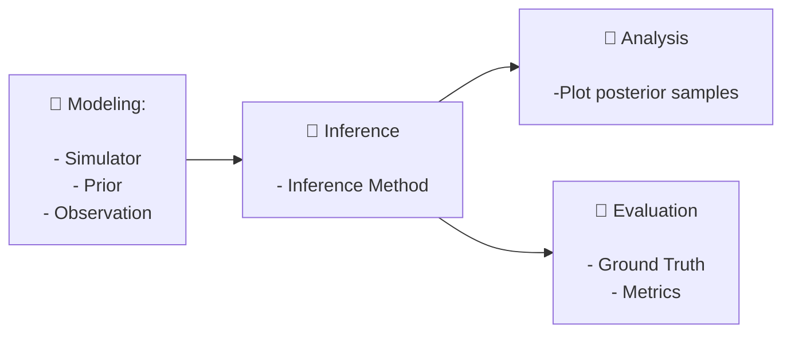

# LFI

*A Python package for likelihood-free inference (LFI) methods*

## Installation

Requires **Python 3.11** (recommended for compatibility with all optional dependencies).

The package has a lightweight base install (JAX + R2OMC) with optional extras for torch-based and ELFI-based inference:

| Variant | Command | Includes |
|---|---|---|
| Base (R2OMC / JAX) | `pip install lfi` | jax, optax, scipy, sklearn, ... |
| ELFI-based inference | `pip install lfi[elfi]` | + elfi |
| Torch CPU | see below | + torch (cpu), sbi |
| Torch GPU | `pip install lfi[torch-gpu]` | + torch (gpu), sbi |
| Full CPU | see below | + torch (cpu), sbi, elfi |
| Full GPU | `pip install lfi[full-gpu]` | + torch (gpu), sbi, elfi |

For **CPU-only torch** variants, pre-install torch from the CPU wheel before installing `lfi`:

```bash
pip install torch --index-url https://download.pytorch.org/whl/cpu
pip install lfi[torch-cpu]   # or lfi[full-cpu]
```

**Create fresh conda environments for each variant:**

```bash
# base (R2OMC / JAX CPU)
conda create -n lfi-base python=3.11 -y
conda run -n lfi-base pip install -e .

# elfi
conda create -n lfi-elfi python=3.11 -y
conda run -n lfi-elfi pip install -e ".[elfi]"

# torch-cpu
conda create -n lfi-torch-cpu python=3.11 -y
conda run -n lfi-torch-cpu pip install torch --index-url https://download.pytorch.org/whl/cpu
conda run -n lfi-torch-cpu pip install -e ".[torch-cpu]"

# full-cpu
conda create -n lfi-full-cpu python=3.11 -y
conda run -n lfi-full-cpu pip install torch --index-url https://download.pytorch.org/whl/cpu
conda run -n lfi-full-cpu pip install -e ".[full-cpu]"
```

> **Note on GPU JAX:** the base install uses CPU JAX. To enable GPU acceleration for R2OMC, run `pip install jax[cuda12]` after installing `lfi`.

## How It Works

`lfi` follows a structure pipeline consisting of four main stages:




Simple Example

```python
import lfi
import torch
import numpy as np

# modeling
prior = lfi.priors.UniformPrior(dim=2, low=-1, high=1)
simulator = lfi.simulators.GaussianNoise(dim=2, dim_y=2, sigma_noise=0.1)
observation = np.array([[0.5, 0.5]])

# inference
method = lfi.inference.from_sbi.NPE_C_SingleRound(
    prior=prior,
    simulator=simulator,
    observation=observation
)
samples_inferred = method.fit_and_sample(budget=1000, nof_samples=100)

# analysis
method.plot_posterior_samples(samples_inferred)

# evaluation
samples_gt = lfi.ground_truth.Gaussian(
    dim=2,
    mu=np.array([0.5, 0.5]),
    sigma=np.array([[0.1, 0.1]])
).sample(100)

lfi.evaluation.c2st(samples_inferred, samples_gt)
```

## Simulator

Example usage:
```python
simulator = lfi.simulators.GaussianNoise(sigma_noise=0.1)
```

Ready-to-use simulators are available in `lfi/simulators.py`

| **Name**         | **Description**
|------------------|------------------------
| `gaussian_noise` | $y \sim \theta + \epsilon$
| `bimodal_gaussian`| $y \sim 0.5 \mathcal{N}(y; \theta-3, \sigma I) + \mathcal{N}(y; \theta + 3, \sigma I)$

- To implement a simulator form scratch, inherit the `BaseSimulator` class and implement the required methods
- There are four methods that you can impelement `sample_numpy`, `sample_pytorch`, `sample_jax` and `return_elfi_callable`.
- There is no need to implement all of them. if you want to use a simulator with a specific inference method, you need to implement the corresponding method. Check the compatibility table below.

Complatibility table:

| **Inference Class**   | **Path**              | **Simulator requirement**
|-----------------------|-----------------------|--------------------------
| SBI                   | `inference/from_sbi`  | `sample_pytorch`  
| ELFI                  | `inference/from_elfi` |  `return_elfi_callable`
| custom                |   `inference/custom`  |  depends on the method


**Step 1: Define the Inference Method**

To define an inference method, specify the prior, simulator and observation:

```python
method = <LFI method> (prior, simulator, observation)
```

**Step 2: Perform Inference**

To perform inference, Use the `fit` method. The only required parameter is the `budget`, which specifies the number of simulations the method can run. Additional parameters can also be passed, depending on the method.

```python
method.fit(budget, **kwargs)
```

**Step 3: Sample from the Posterior**

To generate samples from the estimated posterior, use the `sample` method. The only required parameter is `nof_samples`, with the desired number of samples to draw. Like `fit`, the `sample` method accepts additional parameters specific to the method.

```python
samples = method.sample(nof_samples, **kwargs)
```

**Shortcut: Fit and Sample Together**

The `fit_sample` method combines the `fit` and `sample` steps, returning both the samples and the runtime.


`samples, time = method.fit_sample(budget, nof_samples, fit_kwargs={}, sample_kwargs={})`


This simple interface makes it easy to use different LFI methods unders a unified framework. All implemented methods should follow this interface, allowing for easy comparison and evaluation.

### Modeling

#### Priors

Should inherit the `BasePrior` class (./lfi.priors.py) and implement:

- `sample_numpy`: `def sample_numpy(self, nof_samples:int) -> np.ndarray:`

- `sample_pytorch`: `def sample_pytorch(self, nof_samples: int) -> torch.Tensor:`

- `sample_jax`: `def sample_jax(self, nof_samples: int, keys: List[PRNGKEy]) -> jnp.ndarray:` 

- `return_sbi_object:` : returns a [sbi.Prior](https://github.com/sbi-dev/sbi/blob/6d527f7d951939605b34e649676262700062d027/sbi/utils/torchutils.py#L274) nodes

- `return_elfi_priors`: returns a list of [elfi.Prior](https://github.com/elfi-dev/elfi/blob/dev/elfi/model/elfi_model.py#L857objects) nodes

Implemented Priors:

| **Prior**    | **Description**   | **Name**    | **Parameters**   
|--------------|-------------------|------------|-------------------
| Uniform      | Mutlidimensional Uniform prior  | `uniform`    | `low`, `high`, `dim`

#### Simulators

Should inherit the `BaseSimulator` class (./lfi/simulators.py) and implement:

- `simulate_numpy`: `def simulate_numpy(self, theta: np.ndarray) -> np.ndarray:`
- `simulate_pytorch`: `def simulate_pytorch(self, theta: torch.Tensor) -> torch.Tensor:`
- `simulate_jax`: `def simulate_jax(self, theta: jnp.ndarray, keys: List[PRNGKey]) -> jnp.ndarray:`
- `return_elfi_callable`: returns a callable with the signature `elfi_simulator(*th_params, batch_size=1, random_state=None): -> np.ndarray`, i.e., it takes D `elfi.Prior` nodes as first arguments, then `batch_size` and `random_state` as keywords arguments, and returns a numpy array of shape `(batch_size, D_y)`.

Implemented simulators:

| **Simulators**   | **Description**   | **Name**    
|------------------|-------------------| -------------
|Gaussian Noise    | $y \sim \theta + \epsilon$  | `gaussian_noise`
|BimodalGaussian| $y \sim 0.5 \mathcal{N}(y; \theta - 3, \sigma I) + 0.5 \mathcal{N}(y; \theta + 3, \sigma I)$ | `bimodal_gaussian`

#### Observations

A `numpy.ndarray` of shape `(N, D_y)` where `N` is the number of observations and `D_y` is the dimensionality of the observations. Currently, most methods support a single observation.

A list of implemented observations can be found in `./lfi/observations.py`.

| **Observation**   | **Description**   |  **Name**
|-------------------|-------------------|-----------
| Zeros             | Zero vector       | `zeros`
| FromList          | List of observations  | `from_list`

**Example**

```python
import lfi

# Define the prior
prior = lfi.priors.Uniform(low=-5, high=5, dim=2)

# Define the simulator
simulator = lfi.simulators.GaussianNoise(sigma_noise=0.1)

# Define the observation
observation = lfi.observations.Zeros()
observation.sample(nof_obs=1, dim_y=2)
```

#### Inference
 `method.fit_and_sample(budget, nof_samples, fit_kwargs={}, sample_kwargs={})`

 **Implemented Methods**

 |  **Method**    | **Description**  | **Name** | **fit_kwargs**  | **sample_kwargs**
 |----------------|-------------------|---------|------------------|----------------
 | `NPE_A_SingleRound`  | [NPE_A](https://sbi-dev.github.io/sbi/latest/reference/inference/#sbi.inference.trainers.npe.npe_a.NPE_A)   | `npe_a`   | `num_components`, `training_batch_size`, `max_num_epochs`

#### Implemented Examples

**Example 1 - Gaussian Noise Simulator**

-Prior: $\theta \sim \mathcal{U}[-5, 5]$
-Simulator: $y \sim \theta + \epsilon$

Table 1.1: C2ST Metric by Method and Budget (Dim=2)
                                                
| Method     | 1000    | 5000  | 10000   | 50000   | 100000   | 200000
|------------|---------|-------|---------|---------|----------|-----------
| MCABC      | 0.99    | 0.90  | 0.85    | 0.71    | 0.53
| SMCABC     | 0.975   | 0.57  |  0.5    | 0.585   | 0.565
| NPE_A      | 0.76    | 0.71  | 0.62    | 0.605   | 0.625   |
| NPE_C      | 0.59    | 0.45  | 0.465   | 0.535   |  0.475
| FMPE       | 0.97    | 0.94  | 0.93    | 0.745   | 0.72


Table 1.2: C2ST Metric by Method and Budget (Dim=5)

|Method      | 1000    |  5000 | 10000   | 50000   | 100000   | 200000
|------------|---------|-------|---------|---------|----------|----------
| MCABC      | 0.99    | 0.994 | 0.99    | 0.994   | 0.985    | 0.985
| SMCABC     | 0.99    | 0.99  | 0.895   | 0.51    |  0.425   |
| NPE_A      | 0.875   | 0.805 | 0.75    |  0.78   |  0.69    |
| NPE_C      | 0.89    | 0.69  | 0.545   |  0.575  |  0.52    |
| FMPE       | 0.98    | 0.875 | 0.865   | 0.894   | 0.89

Table 1.3: C2ST Metric by Method and Budget (Dim=10)

|Method     | 1000    | 5000   | 10000  | 50000    | 100000  | 200000
|-----------|---------|--------|--------|----------|---------|---------
| MCABC     | 1.0     | 1.0    | 1.0    | 1.0      | 1.0     | 
| SMCABC    | 1.0     | 0.994  | 0.99   | 0.87     | 0.95
| NPE_A     | 0.985   | 0.84   | 0.88  | 0.945    | 0.794
| NPE_C     | 0.975   | 0.965  | 0.845 | 0.44     | 0.53
| FMPE      | 0.975   | 0.954  | 0.945 | 0.945   | 0.945    | 0.955

Table 1.4: C2ST Metric by Method and Budget (Dim=20)

|Method   | 1000   | 5000   | 10000 | 50000 |  100000 | 200000
|---------|--------|--------|-------|-------|---------|--------
| NPE_A   | 0.98   | 0.99   | 0.98  | 0.985 |  0.88   |  0.805
| NPE_C   | 0.985  | 0.965  | 0.955 | 0.55  | 0.53  
| FMPE    | 0.994  | 0.96   | 0.97  | 0.919 | 0.93

Table 1.5: C2ST Metric By Method and Budget (Dim=30)

|Method  |  1000  |  5000 |  10000  | 50000 | 100000 | 200000
|--------|--------|-------|---------|-------|--------|--------
| NPE_C  | 0.97   | 0.96  | 0.935  |  0.675 | 0.56
| FMPE   | 0.98   | 0.975 | 0.965  |  0.915 | 0.905

Table 1.6: C2ST Metric By Method and Budget (Dim=40)

| Method  | 1000  |  5000 | 10000  |  50000 | 100000
|---------|-------|-------|--------|--------|-------
| NPE_C   | 0.985 | 0.96  | 0.95   | 0.74   | 0.55
| FMPE    | 0.96  | 0.98  | 0.975  | 0.95   | 0.925

**Example 2: Bimodal Gaussian Simulator**

-Prior: $\theta \sim \mathcal{U}[-10, 10]$
-Simulator: $y \sim 0.5 \mathcal{N}(y; \theta - 3, \sigma I) + 0.5 \mathcal{N}(y; \theta + 3, \sigma I)$

Table 2.1: C2ST Metric By Method and Budget (Dim=2)

| Method| 1000|  5000  | 10000 | 50000 | 100000|
|-------|-----|--------|-------|-------|--------
| MCABC | 0.98| 0.865  | 0.635 | 0.495 | 0.55  |
| SMCABC| 0.965| 0.58  | 0.405 | 0.465 | 0.51   
| NPE_A | 0.56 | 0.475 | 0.56  | 0.45  | 0.58
| NPE_C | 0.7  | 0.48  | 0.48  | 0.45   |  0.425
| FMPE  | 0.97 | 0.94  | 0.93  | 0.745  |  0.72

Table 2.2: C2ST Metric By Method and Budget (Dim=5)

| Method | 1000  | 5000  | 10000  | 50000  | 100000 | 200000
|--------|-------|-------|--------|--------|--------|--------
| MCABC  | 0.99  | 0.985 | 0.995  | 0.965  | 0.975 | 0.965
| SMCABC | 0.98  | 0.97  | 0.965   | 0.69  | 0.595  |  
| NPE_A  | 0.93  | 0.945 | 0.9    | 0.925  | 0.935
| NPE_C  | 0.9   | 0.8   | 0.78   |  0.89  | 0.885
| FMPE   | 0.985 | 0.97  | 0.905  | 0.78   | 0.78

Table 2.3: C2ST Metric By Method and Budget (Dim=10)

| Method | 1000 | 5000  | 10000  | 50000  | 100000 
|--------|------|-------|--------|--------|--------
|MCABC   | 0.975| 0.99  | 0.995  |  1.0   | 0.975
| SMCABC | 0.99 | 1.0   |  0.99  |  0.95  | 0.955
| NPE_A  | 0.985| 0.975 | 0.925  |  0.88  | 0.95
| NPE_C  | 0.95 | 0.845 | 0.84   |  0.875 | 0.86
| FMPE   | 0.98 | 0.975 | 0.94   | 0.86   | 0.9

Table 2.4: C2ST Metric By Method and Budget (Dim=20)

|Method | 1000  | 5000  | 10000  | 50000  | 100000
|-------|-------|-------|--------|--------|---------
| NPE_C |  0.975| 0.0875| 0.825  | 0.665  | 0.80 
| FMPE  | 1.0   | 0.075 | 096    | 0.96   | 0.895

Table 2.5: C2ST Metric By Method and Budget (Dim=30)

| Method| 1000  | 5000  | 10000  | 50000  | 100000
|-------|-------|-------|--------|--------|--------
| NPE_C | 1.0   | 0.875 | 0.82   | 0.845  | 0.68
| FMPE  | 1.0   | 1.0   | 0.994  | 0.99   | 0.935

Table 2.6: C2ST Metric By Method and Budget (Dim=40)

| Method| 1000  | 5000  | 10000  | 50000  | 100000
|-------|-------|-------|--------|--------|---------
| NPE_C | 0.99  | 0.93  | 0.925  | 0.815  | 0.78
| FMPE  | 0.99  | 1.0   | 1.0    | 0.985  | 0.985


**Example 3: 2 Moon Simulator**

Prior: $\theta_1, \theta_2 \sim \mathcal{U}[-1,1]$
Simulator: $p = (rcosa + 0.25, rsin(a)), x = p + (\frac{|\theta_1 + \theta_2|}{\sqrt{2}}, \frac{-\theta_1 + \theta_2}{\sqrt{2}})$

Table 3.1: C2ST Metric By Method and Budget

Method|1000  | 10000  | 50000
|-----|------|--------|-------
|MCABC|0.715| 0.68  | 0.78
|SMCABC|0.635 |0.7  |0.7
|NPE_A| 0.64| 0.73 | 0.73
|NPE_C| 0.66| 0.85 | 0.85
|FMPE | 0.845| 0.795| 0.795


